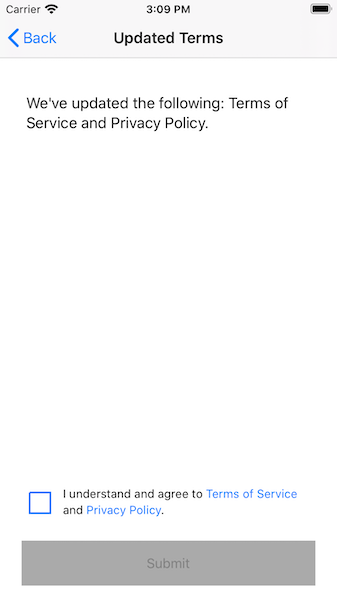
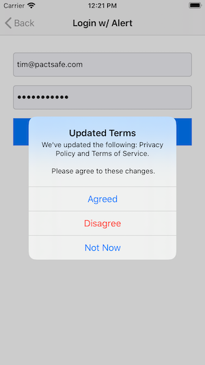

# PactSafe iOS SDK

1. [Requirements](#requirements)
2. [Getting Started](#getting-started)
	* [Integration](#integration)
	* [Notes for Getting Started](#notes-getting-started)
3. [Usage](#usage)
	* [Configure and Initialize](#configure-and-initialization)
	* [Loading a Clickwrap](#loading-clickwrap)
	* [Checking Acceptance](#checking-acceptance)
	* [Send Activity Manually](#send-activity-manually)
	* [Customizing Acceptance Data](#customizing-acceptance-data)

## Requirements {#requirements}

- Xcode 11 or higher
- Target iOS 10.0 or higher
- Swift 5.0+
- PactSafe Published Contracts in Public Group
- PactSafe Group Key
- PactSafe Site Access ID
- PactSafe API Access


## Getting Started {#getting-started}

### Integration {#integration}
#### Swift Package Manager
You can use the [Swift Package Manager](https://swift.org/package-manager/) to install the PactSafe SDK:

https://github.com/pactsafe/pactsafe-ios-sdk.git

#### CocoaPods
You can use [CocoaPods](http://cocoapods.org/) to install the PactSafe SDK by adding it to your Podfile:

```swift
	platform :ios, '10.0'
	use_frameworks!

	target 'MyApp' do
	    pod 'PactSafe', '~> 1.0'
	end
```

#### Carthage
You can use [Carthage](https://github.com/Carthage/Carthage) to install the PactSafe SDK by adding it to your Cartfile:

```swift
	github "PactSafe/pactsafe-ios-sdk" ~> 4.0
```


#### GitHub
Use the [GitHub repo](https://github.com/pactsafe/pactsafe-ios-sdk) to download the entire framework manually.

***


### Notes for Getting Started {#notes-getting-started}

#### Demo iOS App
As you follow along in this guide, you may want to look at the PactSafe iOS Demo App as an example.

#### Debug Mode
Something not quite working the way you expect or you need additional information as to what might not be working? No problem. Simply enable the `debugMode` property on `PSApp.shared`.

```swift
PSApp.shared.debugMode = true
```
#### Test Mode
Optionally, set `testMode` to true as you are testing your implementation. This allows you to delete test data in your PactSafe site.

Note: Don't forget to remove this line before you are finished!

```swift
PSApp.shared.testMode = true
```


## Usage {#usage}

### Configure and Initalize the PactSafe SDK {#configure-and-initialization}
In order to use the PactSafe SDK, you’ll need to import PactSafe into your UIApplicationDelegate:

```swift
import PactSafe
```

Using the SDK also requires authentication, which you’ll want to set up in your `application:didFinishLaunchingWithOptions` delegate.

Note: You MUST configure your PactSafe Site Access ID before using the PSApp shared instance!

```swift
PSApp.shared.configure(siteAccessId: "yourSiteAccessId")
```


### Date Types

Before you start to implement, you may want to become familiar with a few data types used by the iOS SDK.

#### PSSignerID

The `PSSignerID` is only a typealias for a String.

#### PSSigner

The `PSSigner` is a Struct that you'll use to send over your signer information. You must include a `signerId`, which is a `PSSignerID` or String that holds your unique signer ID that PactSafe holds. You can optionally pass over additional custom data with a `PSCustomData` struct, which is covered below.

#### PSCustomData

The `PSCustomData` holds additional information about your signer and can be customized. Please see the properties that are available to be set in the [Customizing Acceptance Data](#customizing-acceptance-data) section.

#### PSGroup

The `PSGroup` is a Struct that holds information about a speciifc group (uses PactSafe group key) that is loaded from the PactSafe API.

#### PSContract

The `PSContract` is a Struct that holds information about contracts within a PactSafe `PSGroup`.

#### PSConnectionData

The `PSConnectionData` is a Struct that holds information about the current connection when sending acceptance to PactSafe. Please see the properties that are available to be set in the [Customizing Acceptance Data](#customizing-acceptance-data) section.


### Loading a Clickwrap {#loading-clickwrap}

The easiest way of getting started with using the PactSafe clickwrap is by utilizing our PSClickWrap class to dynamically load your contracts into a UIView. The PSClickWrap class conforms to the UIView class, which allows you to easily customize and format the clickwrap as needed.

#### Preloading Clickwrap Data

Since your PSClickWrap class will load contracts from your PactSafe site via our API, you may want to preload the data with your group key before you plan on displaying the clickwrap. By preloading, a user will less likely see any sort of loading when they get to the screen that contains the PSClickWrap.

To preload your PactSafe group data, you can use the `preload` method on the PSApp shared instance within your AppDelegate. Example below:

```swift
	PSApp.shared.preload(withGroupKey: "example-pactsafe-group-key")
```

By using the `preload` method, the data is stored using the iOS URLCache class in memory only.

#### Initialize PSClickWrap Class

The PSClickWrap class utilizes the default UIView initializers, giving you flexibility with implementation. You can implement in the following ways:

- **Interface Builder** - add the custom class to a UIView within your storyboard that will load your PactSafe clickwrap.
- **Programatically** - programatically gives you the most flexibility imlementing the PactSafe clickwrap into your project. 

##### Interface Builder
With an empty view in your storyboard, simply subclass the UIView with the PSClickWrap class. Once you subclass the UIView, you’ll need to do some configuring of the ClickWrap within your view controller.

*Note: Don't forget to import PactSafe into your view controller.*

###### IBOutlet your Clickwrap
Make sure to create an IBOutlet to your PSClickWrap UIView in order to customize it.

###### Loads Contracts Into Your Clickwrap
In order to get contracts to load into your clickwrap, you’ll need to use the loadContracts method, where you'll pass in your PactSafe group key.

```swift
override func viewWillAppear(_ animated: Bool) {
    super.viewWillAppear(animated)

    myClickWrap.loadContracts(withGroupKey: "example-mobile-app-group")
}
```

Once loaded, your clickwrap might look something like this:


##### Progamatically


##### Configure Contracts Link Tap Behavior
The PSClickWrap loads the text and links into a UITextView, which gives you some flexibility for customizing link tap behavior. By default, UITextView will take users out of your app and into Safari. If you'd rather keep users in your app, you can use a UITextViewDelegate to adjust the default behavior.

###### Import Safari Services
Within the view controller where you configured your clickwrap, you’ll need to import SafariServices.

```swift
import SafariServices
```

###### Configure Delegate
The PSClickWrap contains a property `textView` that exposes the UITextView that holds your acceptance language and links to your terms.

```swift
// Assign the delegate to your view controller
myClickWrap.textView.delegate = self
```

###### Implement UITextViewDegate Protocol and Method
Having assigned the delegate to your ViewController, you’ll need to add the UITextViewDelegate to your ViewController and use the `shouldInteractWith URL` method.

```swift
extension MyViewController: UITextViewDelegate {
    func textView(_ textView: UITextView, shouldInteractWith URL: URL, in characterRange: NSRange, interaction: UITextItemInteraction) -> Bool {
	    let safariVc = SFSafariViewController(url: URL)
	    present(safariVc, animated: true, completion: nil)
	    return false
    }
}
```

##### Check if Checkbox is Selected {#check-checkbox-selected}
Before letting a user submit the form, you may want to make sure that the checkbox is selected. To do so, you can monitor the value of the checkbox when you configure your clickwrap.

```swift
// Can be used after you load your clickwrap (e.g., after you call loadContracts).
myClickWrap.checkbox.valueChanged = { (isChecked) in
    // If checked, enable (true) your UIButton submit button otherwise ensure it's disabled (false). You may want to also adjust the style of your button here as well.
    if isChecked {
        self.yourSubmitButton.isEnabled = true
    } else {
        self.yourSubmitButton.isEnabled = false
    }
}
```

##### Sending Acceptance
When using PSClickWrap, you can easily send an "agreed" event once they have accepted your contracts. To do this, you'll pass along a signer to the method.

```swift
/// PSClickWrap has a method 'sendAgreed' that allows you to easily send acceptance using a signer id and any custom data.
let signer = PSSigner(signerId: signerId, customData: customData)
myClickWrap.sendAgreed(signer: signer) { (response, error) in
    if error == nil {
        // Use PSCustomData to send additional data about the activity
      	var customData = PSCustomData()
        customData.firstName = firstNameText
        customData.lastName = lastNameText

        // Create the signer with the specified id and custom data.
        let signer = PSSigner(signerId: emailAddressText, customData: customData)
                
        // Use the sendAgreed method on the clickwrap to send acceptance.
        self.pactSafeClickWrap.sendAgreed(signer: signer) { (error) in
						if error == nil {
                // Handle next step
             } else {
                // Handle error
             }
          }
       }
    } else {
        // Handle error
    }
}
```


## Checking Acceptance {#checking-acceptance}

We provide a few of ways checking acceptance and optionally presenting if major version changes have been published. The following are three potential options.

- Using the signedStatus method
- Using a PSAcceptanceViewController
- Using signedStatus Method and Present Alert


### Using the signedStatus Method

The `signedStatus` method gives you the opportuntiy to check on the status of acceptance within a specific PactSafe group.

```swift
let signerId = "test@pactafe.com"
let psGroupKey = "example-group-key"

// The signedStatus method will return a boolean of whether the specified signer id has accepted all contracts within the group key. If they do need to accept a more recent version, the ids of contracts will be returned in an array [String].
ps.signedStatus(for: signerId, groupKey: psGroupKey) { (needsAcceptance, contractIds) in 
    if needsAcceptance {
      // Handle showing acceptance needed.
    } else {
      self.segueHome()
    }
}
```


### Using a PSAcceptanceViewController {#psAcceptanceViewController}
You can optionally choose to utilize the PSAcceptanceViewController in order to conveniently present to your users which contracts had major changes, what the changes were (if change summary is provided within PactSafe), and an opportunity to accept them.

#### What it Looks Like
We provide a simple implementation that can be easily customized to incorporate your brand styling. More on styling later in the documentation.



#### Setting It Up
```swift
// Set up your PSApp.shared instance for use.
let ps = PSApp.shared

// Set the PactSafe group key you plan to check.
let groupKey: String = "my-pactsafe-group-key"

/**
 * Use the signedStatus method to get acceptance information.
 * You'll pass in the signer id that you want to check for and your group key.
 * The method will return whether any acceptance is needed and the contract ids that need acceptance.
*/
ps.signedStatus(for: signerId, in: groupKey) { (needsAcceptance, contractIds) in
    if needsAcceptance {
        DispatchQueue.main.async {
            /// Call the PSAcceptanceViewController with the group key, signer id, and contract ids that need to be accepted.
            let psAcceptanceVc = PSAcceptanceViewController(groupKey, signerId, contractIds)
            
            // Since PSAcceptanceViewController conforms to UIViewController, you can configure your presentation.
            psAcceptanceVc.modalPresentationStyle = .automatic
            psAcceptanceVc.modalTransitionStyle = .coverVertical
            self.present(psAcceptanceVc, animated: true, completion: nil)
        }
    } else {
        // No acceptance is needed, so move them to where they should go.
        DispatchQueue.main.async {
            self.segueToHome()
        }
    }
}

```

#### Receive Notice of Acceptance
You'll probably want to know if the user checked the box and then clicked submit. You'll need to adopt a `PSAcceptanceViewControllerDelegate` protocol to your ViewController and implement the `receivedAcceptance` method to know acceptance was received. Implementation may look something like this:

```swift
extension MyViewController: PSAcceptanceViewControllerDelegate {
    func receivedAcceptance() {
        // Take your action here
        loginUser()
    }
}
```

### Using signedStatus Method and Present Alert {#present-alert}
You may want a more simple approach of presenting that acceptance is needed or need greater customization. To get details around acceptance status, we provide two methods `signedStatus` and `loadGroup` that help you get the appropriate information for displaying to a user.

```swift
/// Get the status for a specific signer in a group.
ps.signedStatus(for: signerId, groupKey: groupKey) { (needsAcceptance, contractIds) in
		if needsAcceptance {
			self.showContractUpdates(forSignerId: signerId, password: passwordText)
		} else {
			// Handle next step
		}
}

private func showContractUpdates(forSignerId signerId: String,
                                 password passwordText: String,
                                 filterContractIds: [String]? = nil) {
	self.ps.loadGroup(groupKey: self.groupKey) { (groupData, error) in
		guard let groupData = groupData, let contractsData = groupData.contractData else { return }
		self.psGroupData = groupData
		
		var titlesOfContracts = [String]()
            
		var updatedContractsMessage: String = "We've updated the following: "
		
		if let cidsFilter = filterContractIds {
			contractsData.forEach { (key, value) in
				if cidsFilter.contains(key) { titlesOfContracts.append(value.title) }
					}
				} else {
					contractsData.forEach { (key, value) in
					titlesOfContracts.append(value.title)
				}
			}
                                              
			let contractTitles = titlesOfContracts.map { String($0) }.joined(separator: " and ")
			updatedContractsMessage.append(contractTitles)
			updatedContractsMessage.append(".\n \n Please agree to these changes.")
                                              
			let alert = self.updatedTermsAlert("Updated Terms", message: updatedContractsMessage, email: signerId, password: passwordText)
					self.present(alert, animated: true, completion: nil)
				}
			}
	}


```

By getting these details and using a UIAlertController, you could show an alert for the user that there have been updated terms and provide them a few available actions.





## Sending Activity Manually {#send-activity-manually}

There may be times when you need to send an activity event manually. Doing so just requires using the `send` method on your PactSafe shared instance.

Here's an example method that would allow you to send acceptance:

```swift
func send(for signer: PSSigner) {
    PSApp.shared.sendActivity(.agreed, signer: signer, group: groupData) { (error) in
  	if error !== nil {
      print("Error sending acceptance.")
    }                                                                       
	}
}
```

## Customizing Acceptance Data {#customizing-acceptance-data}
By default, when you send an activity event with the SDK, some additional information about the device will be sent to PactSafe.

There are two parts of data that will be sent as part of the activity event, which you may want to reference as you are implementing the SDK.

- Connection Data
- Custom Data

### Connection Data
Below, you'll find information on what to expect the SDK to send over as part of the activity event as "Connection Data", which is viewable within a PactSafe activity record. Many of the properties are set upon initialization except the optional properties (marked as optional below) using the following Apple APIs: `UIDevice`, `Locale`, and `TimeZone`. If you need further information about these properties, please reach out to us directly.

| Property                | Description                                                  | Overridable |
| ----------------------- | ------------------------------------------------------------ | ----------- |
| `clientLibrary`         | The client library name being used that is sent as part of the activity. | No          |
| `clientVersion`         | The client library version being used that is sent as part of the activity. | No          |
| `deviceFingerprint`     | The unique identifier that is unique and usable to this device. | No          |
| `environment`           | The mobile device category being used (e.g,. tablet or mobile). | No          |
| `operatingSystem`       | The operating system and version of the device.              | No          |
| `screenResolution`      | The screen resolution of the device.                         | No          |
| `browserLocale`         | The current locale identifier of the device.                 | Yes         |
| `browserTimezone`       | The current time zone identifier of the device.              | Yes         |
| `pageDomain` (Optional) | The domain of the page being viewed. *Note: This is normally for web pages but is available to be populated if needed.* | Yes         |
| `pagePath` (Optional)   | The path of the page being viewed. *Note: This is normally for web pages but is available to be populated if needed.* | Yes         |
| `pageQuery` (Optional)  | The query path on the page being viewed. *Note: This is normally for web pages but is available to be populated if needed.* | Yes         |
| `pageTitle` (Optional)  | The title of the page being viewed. *Note: This is normally for web pages but is available to be populated if you'd like to use the title of the screen where the PactSafe activity is occurring.* | Yes         |
| `pageUrl` (Optional)    | The URL of the page being viewed. Note: This is normally for web pages but is available to be populated if needed. | Yes         |
| `referrer` (Optional)   | The referred of the page being viewed. *Note: This is normally for web pages but is avaialble to be populated if needed.* | Yes         |


### Custom Data

Custom Data will typically house additional information that you'd like to pass over that will be appended to the activty event. By adding Custom Data to the event, you'll be able to search and filter based on specific custom data within the PactSafe app, which can be beneficial when you have many activity events.

Before sending an activity event, you may want to customize properties on `PSCustomData` that can be set. Be sure to note that properties such as `firstName`, `lastName`, `companyName`, and `title` that are properties on `PSCustomData` are reserved for PactSafe usage only (like seeing the name of an individual within the PactSafe app).

| Property        | Description                                                  | Overridable |
| --------------- | ------------------------------------------------------------ | ----------- |
| `iosDeviceName` | The name of the user's iOS device (e.g., John Doe's iPhone 8). | No          |
| `firstName`     | First Name is a reserved property for custom data in PactSafe but can be set. | Yes         |
| `lastName`      | Last Name is a reserved property for custom data in PactSafe but can be set. | Yes         |
| `companyName`   | Company Name is a reserved property for custom data in PactSafe but can be set. | Yes         |
| `title`         | Title is a reserved property for custom data in PactSafe but can be set. | Yes         |