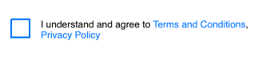
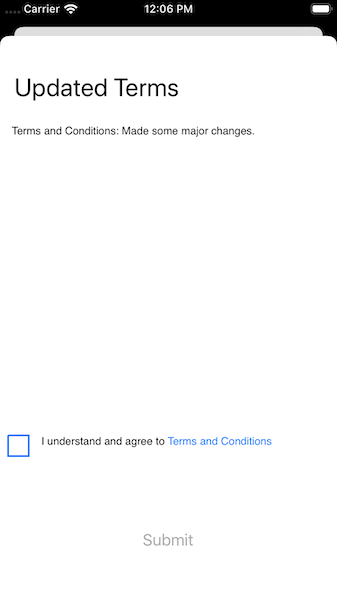

# PactSafe iOS SDK

## Prerequisites

- XCode 11 or higher
- Target iOS 10.0 or higher
- PactSafe Published Contracts in Public Group
- PactSafe Group Key
- PactSafe API Access Token
- PactSafe Site Access ID

## Getting Started
### What You Need
- Site Access ID
- API Access Token
- PactSafe Group Key

### Adding the PactSafe SDK to Your App
We provide three easy ways of getting the SDK added to your project.

#### CocoaPods
Link to SDK here and instructions.

#### Swift Package Manager
Link to SDK here and instructions

#### Manual Download
Feel free to use the [GitHub repo](https://github.com/pactsafe/pactsafe-ios-sdk) to download the entire framework manually.

### Notes for Getting Started
#### Demo iOS App Available
As you follow along in this guide, you may want to look at the PactSafe iOS Demo App as an example.

#### Debug Mode
Something not quite working the way you expected or need additional information as to what might not be working? No problem. Simply enable the `debugMode` property on your `PSApp.shared` instance.

```swift
PSApp.shared.debugMode = true
```
#### Test Mode
Optionally, set `testMode` to true as you are testing your implementation. This allows you to delete test data in your PactSafe site.

Note: Don't forget to remove this line before you are finished!

```swift
PSApp.shared.testMode = true
```

## Set Up Authentication and Initalize the PactSafe SDK
In order to use the PactSafe SDK, you’ll need to import PactSafe into your UIApplicationDelegate:

```swift
import PactSafe
```

Using the SDK also requires authentication, which you’ll want to set up in your `application:didFinishLaunchingWithOptions` delegate.

In order to authenticate, you'll want to use the class `PSAuthentication` with your credentials and assign it to the `authentication` property on `PSApp.shared`.

```swift
PSApp.shared.authentication = PSAuthentication(accessToken: yourAccessToken,
										    	siteAccessId: yourSiteAccessId)
```

## Using Clickwrap
The following outlines how to get up and running with a PactSafe Clickwrap.

### Loading a Clickwrap
The easiest way of getting started with using the PactSafe clickwrap is by utilizing our PSClickWrap class to dynamically load your contracts into a UIView. The PSClickWrap class conforms to the UIView class, which allows you to easily customize the clickwrap as needed.

#### Interface Builder
With an empty view in your storyboard, simply subclass the UIView with the PSClickWrap class. Once you subclass the UIView, you’ll need to do some configuring of the ClickWrap within your View Controller.

###### IBOutlet your Clickwrap
Make sure to create an IBOutlet to your PSClickWrap UIView in order to customize it.

###### Loads Contracts Into Your Clickwrap
In order to get contracts to load into your clickwrap, you’ll need to use the loadContracts method, where you'll pass in your group key. It would look something like this:

```swift
override func viewWillAppear(_ animated: Bool) {
    super.viewWillAppear(animated)

    myClickWrap.loadContracts(withGroupKey: "example-mobile-app-group")
}
```

Once your contracts have loaded, your clickwrap might look something like this:


##### Configure Contracts Link Tap Behavior
The PSClickWrap contracts text loads into a UITextView, which gives you some flexibility for customizing link tap behavior. By default, UITextView will take users out of your app and into Safari. If you want to keep users in your own app, you can use a UITextViewDelegate to handle the behavior.

In order to use the UITextViewDelegate and keep users within your app, you’ll need to do the following:

###### Import Safari Services
Within the ViewController where you configured your clickwrap, you’ll need to import SafariServices

```swift
import SafariServices
```

###### Configure Delegate
The PSClickWrap contains a property `textView` that exposes the UITextView that contains your acceptance language. Since it's a UITextView, you can use the delegate it provides.

```swift
myClickWrap.textView.delegate
```

###### Implement UITextViewDegate Protocol and Method
Having assigned the delegate to your ViewController, you’ll need to add the UITextViewDelegate to your ViewController and use the `shouldInteractWith URL` method.

```swift
extension MyViewController: UITextViewDelegate {
    func textView(_ textView: UITextView, shouldInteractWith URL: URL, in characterRange: NSRange, interaction: UITextItemInteraction) -> Bool {
	    let safariVc = SFSafariViewController(url: URL)
	    present(safariVc, animated: true, completion: nil)
	    return false
    }
}
```

### Check if Checkbox is Selected
Before letting a user submit the form, you may want to make sure that the checkbox is selected. To do so, ou can monitor the value of the checkbox when you configure your clickwrap.

```swift
// This is set up when you configure your clickwrap (e.g., after you call loadContracts).
myClickWrap.checkbox.valueChanged = { (isChecked) in
    // If checked, enable the submit button
    if isChecked {
        self.yourSubmitButton.isEnabled = true
    } else {
        self.yourSubmitButton.isEnabled = false
    }
```

### Sending Acceptance
When using PSClickWrap, you can easily send an "agreed" event once they have accepted your contracts. To do this, you'll pass along the signer id and any custom data that you'd like to send to PactSafe.

```swift
// PSClickWrap has a method 'sendAgreed' that allows you to easily send acceptance using a signer id and any custom data.
myClickWrap.sendAgreed(signerId: signerId, customData: customData) { (data, response, error) in
    if error == nil {
        self.performSegue(withIdentifier: "signUpToHomeSegue", sender: self)
    } else {
        self.formAlert("\(String(describing: error))")
    }
}
```

## Checking for Acceptance
Within the SDK, we provide a few of ways checking acceptance and presenting if major version changes have since been published and need to be accepted. The following are three potential options.

- Using the PSAcceptanceViewController
- Creating a UIAlert
- Utilizing a method we provide

### Check Acceptance and Present Using PSAcceptanceViewController
You can optionally choose to utilize the PSAcceptanceViewController in order to conveniently present to your users which contracts had major changes, what the changes were (if change summary is provided within PactSafe), and a PSClickWrap for users to easily accept the updated terms.

#### What it Looks Like
We provide a fairly barebones implementation but can be easily customized to incorproate your brand styling. More on styling later in the documentation.



#### Setting It Up
We make it easy to get acceptance information and set-up your PSAcceptanceViewController. Doing so only requires a few lines of code.

```swift
// Set up your PSApp.shared instanece for use.
let ps = PSApp.shared

// Set your group key.
let groupKey: String = "my-pactsafe-group-key"

/**
 * Use the getSignedStatus method to get acceptance information.
 * You'll pass in the signer id that you want to check for and your group key.
 * The method will return whether any acceptance is needed and the contract ids that need acceptance.
*/
ps.signedStatus(for: signerId, in: groupKey) { (needsAcceptance, contractIds) in
    if needsAcceptance {
        DispatchQueue.main.async {
            /// Call the PSAcceptanceViewController with the group key, signer id, and
            /// contract ids that need to be acceptanced.
            let psAcceptanceVc = PSAcceptanceViewController(groupKey, signerId, contractIds)
            
            // Since PSAcceptanceViewController conforms to UIViewController, you can configure your presentation.
            psAcceptanceVc.modalPresentationStyle = .automatic
            psAcceptanceVc.modalTransitionStyle = .coverVertical
            self.present(psAcceptanceVc, animated: true, completion: nil)
        }
    } else {
        // No acceptance is needed, so move them to where they should go.
        DispatchQueue.main.async {
            self.segueToHome()
        }
    }
}

```

#### Receiving Notice of Acceptance
You'll probably want to know if the user checked the box and then clicked submit. You'll need to adopt the protocol to your ViewController and implement the `receivedAcceptance` method to know when they submit acceptance. Implementation may look like this.

```swift
extension MyViewController: PSAcceptanceViewControllerDelegate {
    func receivedAcceptance() {
        // Take your action here
        loginUser()
    }
}
```

### Checking Acceptance and Presenting an Alert
You may want a more simple approach of presenting that acceptance is needed or want to need more customization. To get details around acceptance status, we provide two methods `getSignedStatus` and `getContractDetails` that help you get the appropriate information for displaying to a user.

```swift
/// Get the status for your user by supplying
/// their signer id and a group key to the getSignedStatus method.

ps.getSignedStatus(for: signerId, in: groupKey) { (needsAcceptance, contractIds) in
    if needsAcceptance {
        guard let contractIds = contractIds else { return }
        
        self.ps.contractsDetails(with: contractIds) { (contracts, error) in
            
            var updatedContractMessage = "We've updated the following: "
            
            for contract in contracts {
                guard let contract = contract else { return }
                let contractTitle = contract.publishedVersion.title
                updatedContractMessage.append(contractTitle + " ")
            }
            
            updatedContractMessage.append("\n \n Please agree to these changes.")
            
            DispatchQueue.main.async {
                let alert = self.updatedTermsAlert("Updated Terms", message: updatedContractMessage, email: emailAddressText, password: passwordText)
                self.present(alert, animated: true, completion: nil)
            }
        }
    } else {
        DispatchQueue.main.async {
            self.segueToHome()
        }
    }
}
```

By getting these details and using a UIAlertController, you could show a simple alert like the following to the user:


### Sending Acceptance Manually
There may be times when you need to send an activity event manually. Doing so just requires using the `send` method on your PactSafe shared instance.

Here's an example method that would allow you to send acceptance:

```swift
func sendAcceptance(for signerId: String) {
    self.ps.send(activity: .agreed,
    signerId: signerId,
    contractIds: self.contractIds,
    contractVersions: self.contractVersions,
    groupId: nil,
    customSignerData: nil) { (data, response, error) in
    	print("My response: \(response)")
    }
}
```


## Customizing Activity Custom Data 
By default, when you send an activity event with the SDK, some additional information about the device will be sent to PactSafe.

The following data will be sent by default and is documented here to avoid potential duplication as you work on planning the custom data you pass over.

- **Device Name:** `UIDevice.current.name`
- **Device System Name:** `UIDevice.current.systemName`
- **Device System Version:** `UIDevice.current.systemVersion`
- **Device Identifier for Vendor:** `UIDevice.current.identifierForVendor?.uuidString` (is an optional, which may result in it being an empty string)
- **Locale Identifier:** `Locale.current.identifier`
- **Locale Region Code:** `Locale.current.regionCode` (is an optional, which may result in it being an empty string)
- **Time Zone Identifier:** `TimeZone.current.identifier`
